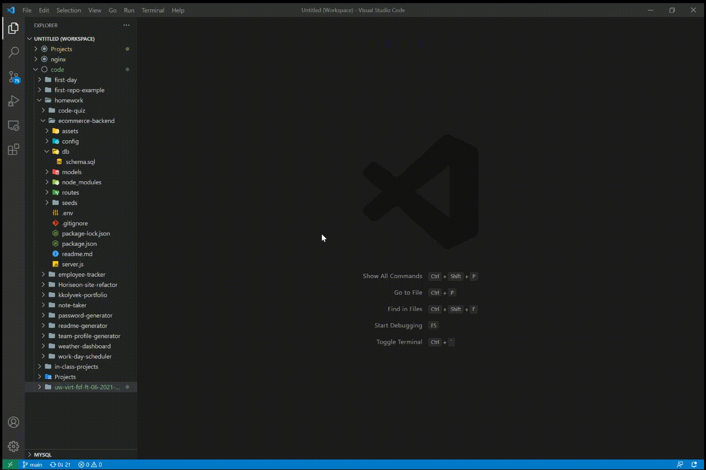

<h1 align="center"><strong>E-Commerce Backend</strong></h1>

  
  

## Description

This repository is an example of a basic e-commerce backend layout that uses express and sequelize. It includes 3 main models; categories, products, and tags. Each category can have multiple products but a product can only exist in one category. However, each product can have multiple tags while each tag can be linked to multiple products. This relationship is defined using the product-tags pivot table.

## Table of Contents

1. [Installation](#installation)
2. [Usage](#usage)
3. [License](#license)
4. [Questions](#questions)

## Installation

In order to interact with the api, the database must first be initialized and seeded. Follow the steps below to install.

1. Run `npm i` to installed required dependencies.
2. Create a `.env` file with the following lines:

   - `DB_USER=[your mysql username]`
   - `DB_PW=[your mysql password]`
   - `DB_NAME=ecommerce_db`

3. Log in to mysql2 and run `SOURCE ./db/schema.sql` to initialize the database.
4. Back in the terminal, run `node ./seeds/index.js` to seed the database.

Refer to the video below for an example of the installation process.

> 

## Usage

Once the installation steps have been followed, the database can be interacted with. Refer to the video belows for specific routes and request formatting.

Category routes:

> 

Product routes:

> 

Tag routes:

> 

## License

This is free and unencumbered software released into the public domain.

Anyone is free to copy, modify, publish, use, compile, sell, or
distribute this software, either in source code form or as a compiled
binary, for any purpose, commercial or non-commercial, and by any
means.

In jurisdictions that recognize copyright laws, the author or authors
of this software dedicate any and all copyright interest in the
software to the public domain. We make this dedication for the benefit
of the public at large and to the detriment of our heirs and
successors. We intend this dedication to be an overt act of
relinquishment in perpetuity of all present and future rights to this
software under copyright law.

THE SOFTWARE IS PROVIDED "AS IS", WITHOUT WARRANTY OF ANY KIND,
EXPRESS OR IMPLIED, INCLUDING BUT NOT LIMITED TO THE WARRANTIES OF
MERCHANTABILITY, FITNESS FOR A PARTICULAR PURPOSE AND NONINFRINGEMENT.
IN NO EVENT SHALL THE AUTHORS BE LIABLE FOR ANY CLAIM, DAMAGES OR
OTHER LIABILITY, WHETHER IN AN ACTION OF CONTRACT, TORT OR OTHERWISE,
ARISING FROM, OUT OF OR IN CONNECTION WITH THE SOFTWARE OR THE USE OR
OTHER DEALINGS IN THE SOFTWARE.

For more information, please refer to <http://unlicense.org/>

---

## Questions

For further questions and comments, please reach out through [GitHub](https://github.com/kkolyvek) or via email at kk674@uw.edu.
